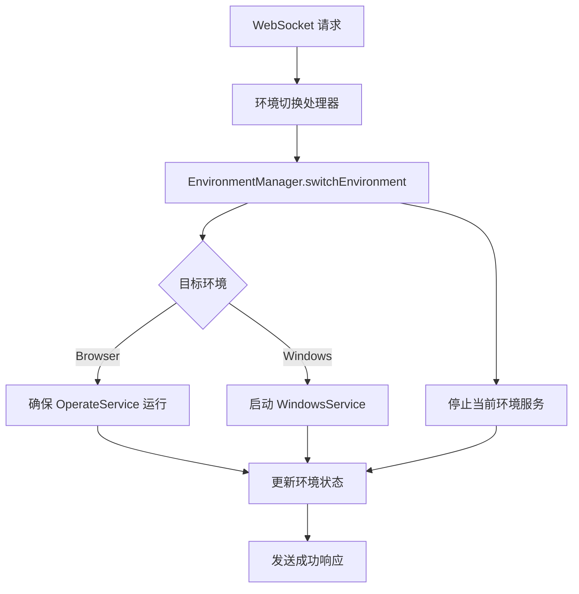

# Windows 支持架构重构总结

## 🎯 重构目标

将 Windows 平台支持从 `OperateService`（专门负责 Web 操作）中解耦，创建独立的 Windows SDK 服务，实现清晰的架构分离。

## 🏗️ 新架构设计

### 架构层次

```
┌─────────────────────────────────────┐
│         WebSocket API Layer        │  ← 统一的 API 入口
├─────────────────────────────────────┤
│       EnvironmentManager           │  ← 环境管理和切换
├─────────────────────────────────────┤
│  OperateService │  WindowsService  │  ← 平台特定服务
├─────────────────────────────────────┤
│  BrowserAgent   │  WindowsAgent    │  ← 平台特定 Agent
├─────────────────────────────────────┤
│  BrowserDevice  │  WindowsMock     │  ← 设备抽象层
└─────────────────────────────────────┘
```

### 职责分离

1. **OperateService**: 专门负责 Web/Browser 平台操作
2. **WindowsService**: 专门负责 Windows 平台操作
3. **EnvironmentManager**: 统一管理环境切换和服务协调

## 📋 重构清单

### ✅ 已完成

1. **移除 OperateService 中的 Windows 耦合**
   - 移除 `windowsAgent` 属性
   - 移除 `createWindowsAgent()` 方法
   - 移除 `getCurrentAgent()` 和 `getCurrentEnvironmentType()` 方法
   - 清理 Windows 相关的启动和停止逻辑

2. **创建独立的 WindowsService SDK**
   - 实现单例模式的 `WindowsService` 类
   - 提供完整的生命周期管理（启动、停止、重启）
   - 实现 Windows 特定操作 API
   - 提供事件驱动的状态管理

3. **实现 Windows 环境的独立管理**
   - 创建 `EnvironmentManager` 统一管理器
   - 实现环境切换逻辑
   - 提供服务状态查询和协调
   - 支持事件驱动的环境状态通知

4. **重构环境切换逻辑**
   - 更新 WebSocket 处理器使用 `EnvironmentManager`
   - 移除硬编码的环境状态管理
   - 实现基于服务的环境切换

5. **更新 WebSocket 处理器使用新架构**
   - 重构 `createSwitchEnvironmentHandler`
   - 重构 `createGetEnvironmentStatusHandler`
   - 更新导出函数使用新的管理器

## 🔧 核心组件

### 1. WindowsService (`src/services/windowsService.ts`)

**职责**: Windows 平台的专用服务管理器

**主要功能**:
- 单例模式管理 Windows Agent
- 生命周期管理（启动、停止、重启）
- Windows 特定操作（切换截图、执行 AI 操作）
- 事件驱动的状态通知

**核心 API**:
```typescript
class WindowsService {
  // 生命周期
  async start(): Promise<void>
  async stop(): Promise<void>
  async restart(): Promise<void>
  
  // 状态查询
  isReady(): boolean
  getStatus(): ServiceStatus
  
  // Windows 操作
  async switchMockScreenshot(imageKey: string): Promise<void>
  async executeAiAction(action: string): Promise<void>
  async getScreenshot(): Promise<string>
}
```

### 2. EnvironmentManager (`src/services/environmentManager.ts`)

**职责**: 环境管理和服务协调

**主要功能**:
- 统一的环境切换接口
- 多服务协调管理
- 环境状态查询和监控
- 服务生命周期协调

**核心 API**:
```typescript
class EnvironmentManager {
  // 环境管理
  async switchEnvironment(env: EnvironmentType): Promise<void>
  getCurrentEnvironment(): EnvironmentType
  getEnvironmentStatus(): EnvironmentStatus
  
  // 服务访问
  getCurrentService(): OperateService | WindowsService
  getCurrentAgent(): Agent | null
  
  // 生命周期
  async initializeAllServices(): Promise<void>
  async stopAllServices(): Promise<void>
}
```

### 3. 重构后的环境切换 (`src/websocket/actions/environment.ts`)

**改进**:
- 移除硬编码的环境状态
- 使用 `EnvironmentManager` 进行环境切换
- 简化处理逻辑，委托给专业的管理器

## 🔄 环境切换流程

### 新的切换流程



### 服务启动优化

- **Browser 服务**: 启动时初始化，持续运行
- **Windows 服务**: 按需启动，节省资源
- **环境切换**: 只启动目标环境，停止不需要的服务

## 📊 架构优势

### 1. 清晰的职责分离
- 每个服务专注于单一平台
- 避免跨平台逻辑混合
- 更容易维护和扩展

### 2. 独立的生命周期管理
- 各平台服务独立启停
- 资源使用更高效
- 故障隔离更好

### 3. 可扩展的架构
- 新增平台只需实现新的 Service
- 环境管理器自动适配
- WebSocket API 层无需修改

### 4. 事件驱动的状态管理
- 服务状态变化实时通知
- 更好的监控和调试
- 支持异步操作

## 🔧 配置和使用

### 环境变量
```bash
# Windows 配置
WINDOWS_MOCK_SCREENSHOT_DIR=/path/to/screenshots
```

### WebSocket API
```javascript
// 切换环境
{
  "meta": { "messageId": "msg-001" },
  "payload": {
    "action": "switchEnvironment",
    "params": "windows"  // 或 "browser"
  }
}

// 查询状态
{
  "meta": { "messageId": "msg-002" },
  "payload": {
    "action": "getEnvironmentStatus"
  }
}
```

### 服务访问
```typescript
// 获取环境管理器
const envManager = EnvironmentManager.getInstance()

// 获取当前服务
const currentService = envManager.getCurrentService()

// 获取 Windows 服务
const windowsService = envManager.getWindowsService()
```

## 🚀 未来扩展

### 支持新平台
1. 创建新的平台服务（如 `MacOSService`）
2. 在 `EnvironmentManager` 中注册
3. 更新类型定义和环境列表
4. WebSocket API 自动支持

### 增强功能
- 服务健康检查和自动恢复
- 环境切换历史记录
- 性能监控和指标收集
- 配置热重载

## 📝 迁移说明

### 对现有代码的影响
- **OperateService**: 恢复为纯 Web 服务，移除 Windows 相关代码
- **WebSocket 处理器**: 使用新的环境管理器，逻辑更简洁
- **主入口**: 使用环境管理器初始化所有服务

### 向后兼容性
- WebSocket API 接口保持不变
- 环境切换功能完全兼容
- 现有的 Browser 操作不受影响

这次重构实现了清晰的架构分离，为未来的平台扩展奠定了良好的基础！🎯
