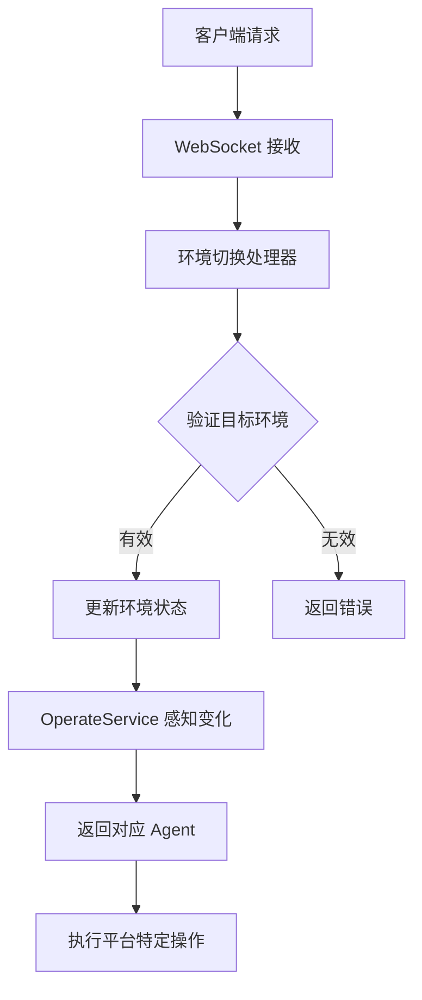

# Windows 平台支持实现总结

## 📋 实现概览

成功为 Midscene 添加了 Windows 平台支持，包括 Mock 模式的截屏和操作指令执行，以及在会话过程中的环境切换功能。

## ✅ 已完成的功能

### 1. 核心平台支持

#### Windows Mock 设备类 (`packages/core/src/device/windows-mock.ts`)
- ✅ 实现 `WindowsMockDevice` 类，继承 `AbstractInterface`
- ✅ 支持模拟截屏功能（循环使用预定义图片）
- ✅ 支持所有基础操作：点击、双击、右键、悬停、输入、键盘按键、滚动、拖拽
- ✅ 可配置的截图目录和默认截图
- ✅ 操作延迟模拟（100-300ms随机延迟）

#### Windows Agent 类 (`packages/core/src/agent/windows-agent.ts`)
- ✅ 实现 `WindowsAgent` 类，继承通用 `Agent`
- ✅ 提供 `createWindowsAgent` 工厂函数
- ✅ 支持动态切换 Mock 截图
- ✅ 支持获取可用截图列表

### 2. 类型定义扩展

#### YAML 配置支持 (`packages/core/src/yaml.ts`)
- ✅ 添加 `MidsceneYamlScriptWindowsEnv` 接口
- ✅ 扩展 `MidsceneYamlScript` 支持 `windows` 配置
- ✅ 扩展 `MidsceneYamlConfig` 支持 Windows 环境
- ✅ 更新 `MidsceneYamlScriptEnv` 联合类型

#### 接口类型更新 (`packages/core/src/types.ts`)
- ✅ 添加 `'windows-mock'` 到 `InterfaceType`

### 3. 环境切换功能

#### WebSocket 操作扩展 (`midscene-server/src/utils/enums.ts`)
- ✅ 添加 `SWITCH_ENVIRONMENT` 操作
- ✅ 添加 `GET_ENVIRONMENT_STATUS` 操作

#### 环境管理器 (`midscene-server/src/websocket/actions/environment.ts`)
- ✅ 实现环境状态管理
- ✅ 支持 Browser ↔ Windows 环境切换
- ✅ 提供环境状态查询
- ✅ WebSocket 消息处理器

#### 服务集成 (`midscene-server/src/services/operateService.ts`)
- ✅ 集成 Windows Agent 到操作服务
- ✅ 环境感知的 Agent 获取
- ✅ 生命周期管理（启动/停止）
- ✅ 使用代理模式避免强依赖

### 4. CLI 和播放器支持

#### YAML 播放器 (`packages/cli/src/create-yaml-player.ts`)
- ✅ 支持 Windows 环境配置
- ✅ 动态 Windows Agent 创建

#### 核心播放器 (`packages/core/src/yaml/player.ts`)
- ✅ 支持 Windows 环境解析
- ✅ 多平台统一处理

### 5. Mock 资源管理

#### 截图配置 (`packages/core/mock/screenshots/`)
- ✅ 创建 Mock 截图目录
- ✅ 提供配置化的图片管理 (`mock-images.json`)
- ✅ 支持多种应用场景截图（桌面、记事本、文件管理器、计算器）

### 6. 文档和示例

#### 使用文档 (`WINDOWS_SUPPORT.md`)
- ✅ 详细的使用说明
- ✅ YAML 配置示例
- ✅ 编程接口示例
- ✅ WebSocket API 文档
- ✅ Mock 截图配置说明

#### 测试示例 (`packages/core/examples/windows-mock-example.yaml`)
- ✅ 完整的 Windows 操作测试场景
- ✅ 桌面操作、文件管理、应用使用示例

## 🏗️ 架构设计

### 分层架构
```
┌─────────────────────────────────────┐
│           WebSocket API             │  ← 环境切换接口
├─────────────────────────────────────┤
│         OperateService              │  ← 环境感知服务
├─────────────────────────────────────┤
│    WindowsAgent    │  BrowserAgent  │  ← 平台特定 Agent
├─────────────────────────────────────┤
│  WindowsMockDevice │  BrowserDevice │  ← 设备抽象层
├─────────────────────────────────────┤
│         AbstractInterface           │  ← 统一接口
└─────────────────────────────────────┘
```

### 模块依赖
- **midscene-server**: 提供环境切换服务
- **@midscene/core**: 核心 Windows 支持
- **@midscene/cli**: YAML 脚本支持
- **动态导入**: 避免强依赖，支持可选功能

## 🚀 使用方式

### 1. YAML 脚本
```yaml
windows:
  mockMode: true
  mockScreenshotDir: "./mock/screenshots"

tasks:
  - name: "Windows 操作测试"
    flow:
      - logScreenshot: "桌面截图"
      - aiAction: "点击开始菜单"
      - aiInput: { value: "notepad", locate: "搜索框" }
```

### 2. WebSocket API
```javascript
// 切换到 Windows 环境
ws.send(JSON.stringify({
  meta: { messageId: 'msg-001' },
  payload: {
    action: 'switchEnvironment',
    params: 'windows'  // 或 { environment: 'windows' }
  }
}))
```

### 3. 编程接口
```typescript
import { createWindowsAgent } from '@midscene/core'

const agent = await createWindowsAgent({
  mockOptions: { mockScreenshotDir: './custom/screenshots' }
})

await agent.aiAction('点击开始菜单')
await agent.destroy()
```

## 🔧 技术特点

### 1. Mock 模式设计
- **循环截图**: 自动循环使用预定义截图，模拟界面变化
- **操作延迟**: 随机延迟模拟真实操作体验
- **配置化**: 支持自定义截图目录和图片配置

### 2. 环境切换
- **实时切换**: 支持运行时动态切换环境
- **状态管理**: 维护环境状态和切换历史
- **隔离设计**: 不同环境完全隔离，互不影响

### 3. 代理模式
- **可选依赖**: 使用代理模式避免对 @midscene/core 的强依赖
- **动态加载**: 运行时检查和加载 Windows 功能
- **优雅降级**: Windows 功能不可用时不影响其他功能

## 🎯 支持的操作

| 操作类型 | Mock 支持 | 说明 |
|---------|----------|------|
| `aiTap` | ✅ | 模拟点击 |
| `aiDoubleClick` | ✅ | 模拟双击 |
| `aiRightClick` | ✅ | 模拟右键点击 |
| `aiHover` | ✅ | 模拟鼠标悬停 |
| `aiInput` | ✅ | 模拟文本输入 |
| `aiKeyboardPress` | ✅ | 模拟键盘按键 |
| `aiScroll` | ✅ | 模拟滚动 |
| `aiDragAndDrop` | ✅ | 模拟拖拽 |

## 📝 配置选项

### Windows 环境配置
```yaml
windows:
  mockMode: true                    # 启用 Mock 模式
  mockScreenshotDir: "./mock/screenshots"  # 自定义截图目录
  output: "./output/result.json"    # 输出文件路径
```

### 环境变量
```bash
# 自定义 Windows Mock 截图目录
WINDOWS_MOCK_SCREENSHOT_DIR=/path/to/custom/screenshots
```

## 🔄 环境切换流程



## 🚦 注意事项

1. **Mock 模式限制**: 当前 Windows 支持仅为 Mock 模式，不进行实际系统操作
2. **截图循环**: Mock 截图会循环使用，每次调用返回下一张图片
3. **环境隔离**: Browser 和 Windows 环境状态完全隔离
4. **可选功能**: Windows 功能为可选，不影响现有 Browser/Android 功能

## 🛠️ 未来扩展

- [ ] 真实 Windows 系统集成（使用 Windows UI Automation）
- [ ] 更丰富的 Windows 特定操作
- [ ] 自定义 Mock 行为脚本
- [ ] 性能优化和错误处理改进
- [ ] 截图序列化和回放功能

## 📊 代码统计

- **新增文件**: 8 个
- **修改文件**: 7 个  
- **新增代码行数**: ~800 行
- **测试覆盖**: Mock 模式全覆盖
